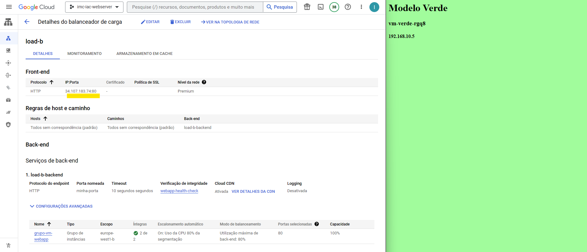

# Criando uma infraestrutura no Google Cloud, utilizando Terraform.
## O script de IAsC Terraform criará um Grupo de Instancias que hospedará uma aplicação de um website.

### Como dica: crie um projeto novo no GCP e tenha certeza que esteja nele para executar o exemplo.
### Assim, no final, poderá excluir o seu projeto e não ter surpresas no seu cartão de crédito.

# Vamos ao passo a passo:

### Principais pontos do script **infra.tf**
- subir um grupo com um mínimo de 2 instâncias e máxima de 5 baseadas em um modelo
- criar novas instâncias em caso de sobrecarga da instância ou crashes
- criar uma rede e subnet dedicada a este grupo de instâncias
- disponibilizar um balanceador de cargas para acessar a porta 80 (tcp/http) das instancias disponíveis

### Script **provedor.tf**
- Indica ao terraform que o provedor deste script é o Gooble Cloud

### Script **meuterra.sh**
- Para facilitar o processo de execução do terraform no console shell da Google Cloud
  - *terraform init* (inicializa o terraform)
  - *terraform validate* (valida a configuração dos arquivos no diretório)
  - *terraform plan* (planeja a execução dos scripts pelo terraform)
  - *terraform apply* (executa a criação dos recursos nomeados nos scripts)

Após a execução dos scripts, no GCP abra a tela do Load Balancer e copie o IP conforme a tela abaixo e, em outra aba, cole e visualize seu website

### Para ver o grupo de instancias funcionando, vamos estressar uma das VMs:
- abra uma das 2 VMs clicando no botão SSH
- execute o comando *stress -c 2*, deixe o comando executando e minimize essa a janela
- volte em Grupo de Instancias e verá que novas VMs foram criadas
  - o porque disso é que no script infra.tf, nós colocamos um limite de 80% para uso de CPU

### Para ver o grupo de instancias voltar as 2 instancias default:
- volte ao terminal da VM aberta e dê o comando control+C
- e depois exit
- aguarde alguns minutos e verá que o Grupo de Instancias criado automaticamente voltará as 2 instancias

Por fim, para destruir toda a infraestrutura criada acima, basta executar o comando **terraform destroy** e dar yes e ele começara a destruir todos os recursos.

O exemplo é simples, mas lhe dará uma ótima ideia de como trabalhar com Terraform pas subir infraestrutura como código, e lembre-se, antes de fechar sua console GCP, verifique se seus recursos criados foram realmente excluídos para não ter uma surpresa desagradável ou exclua o projeto onde executou este exemplo.

  
